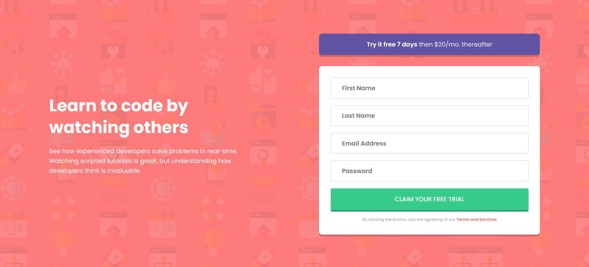

# Frontend Mentor - Intro component with sign up form solution

This is a solution to the [Intro component with sign up form challenge on Frontend Mentor](https://www.frontendmentor.io/challenges/intro-component-with-signup-form-5cf91bd49edda32581d28fd1). Frontend Mentor challenges help you improve your coding skills by building realistic projects.

## Table of contents

- [Overview](#overview)
  - [The challenge](#the-challenge)
  - [Screenshot](#screenshot)
  - [Links](#links)
- [My process](#my-process)
  - [Built with](#built-with)
  - [What I learned](#what-i-learned)
- [Author](#author)

## Overview

### The challenge

Users should be able to:

- View the optimal layout for the site depending on their device's screen size
- See hover states for all interactive elements on the page
- Receive an error message when the `form` is submitted if:
  - Any `input` field is empty. The message for this error should say _"[Field Name] cannot be empty"_
  - The email address is not formatted correctly (i.e. a correct email address should have this structure: `name@host.tld`). The message for this error should say _"Looks like this is not an email"_

### Screenshot

### Links

- Solution URL: [Add solution URL here](https://your-solution-url.com)
- Live Site URL: [See Live](https://signupform-challenge.netlify.app/)

## My process

This is my second project with Vanilla JS and I had a lot of fun. JavaScript give us a lot of options to learn and to make dynamic web pages/applications. Also, I started using more SASS(SCSS) in my projects to make CSS writing faster and cleaner.

### Built with

- Semantic HTML5 markup
- CSS custom properties
- Flexbox
- Mobile-first workflow
- Vanilla JS

### What I learned

I learned so much things doing this challenge. What is NodeList, how to loop through it and display error messages. Also, I learned how to use event function and listen to event.

## Author

- Codepen - [dusanlukic](https://codepen.io/dusanlukic)
- Frontend Mentor - [@dusanlukic404](https://www.frontendmentor.io/profile/dusanlukic404)
